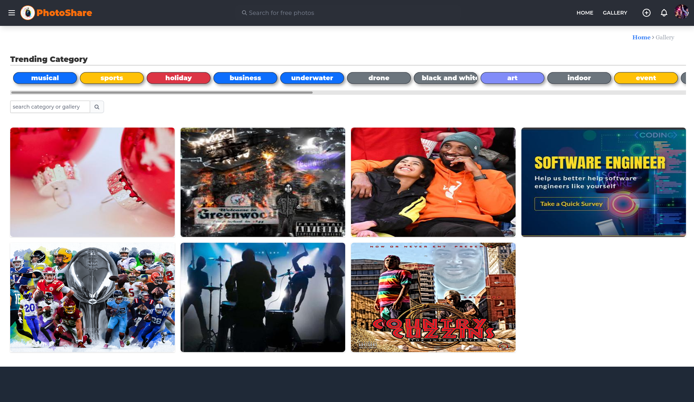
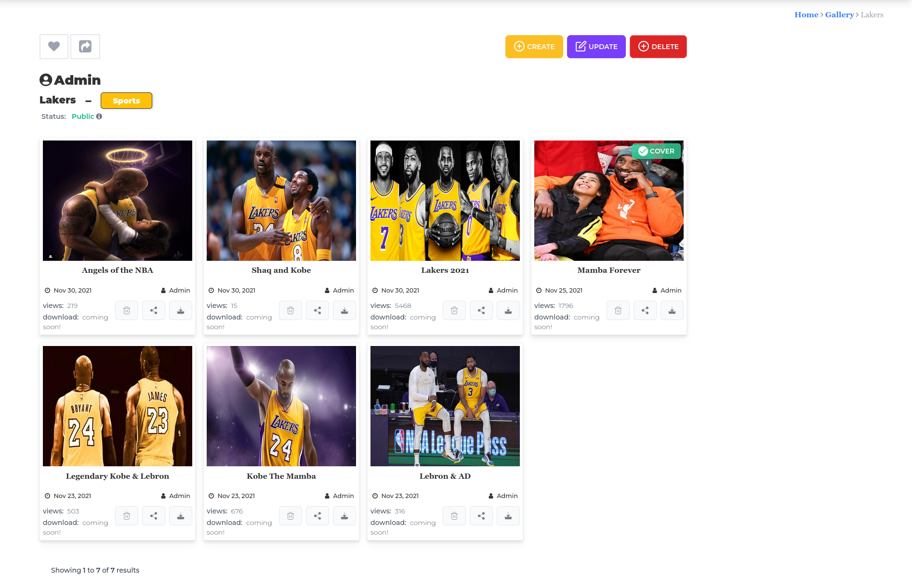

=============
Photo-Share
=============

Photo-share is a Django Photo Sharing Web Application with RESTful API. PhotoShare allows users to easily upload and share their wonderful photos across multiple platforms and social media account. Built with developers in mind, PhotoShare's API lets other software developers seamlessly integrate all of PhotoShare Web functionalities right into an existing application quickly and easily! Want to know more..

==============
Technologies
==============

- `Python <https://www.python.org/>`_
- `Django <https://www.djangoproject.com/>`_
- `Django-rest-framework <https://www.django-rest-framework.org/>`_
- `JavaScript <https://www.javascript.com/>`_
- `PostgreSQL <https://www.postgresql.org/>`_
- `Docker <https://www.docker.com/>`_
- `Tailwindcss <https://tailwindcss.com/>`_
- `Sass <https://sass-lang.com/>`_

+++++++++++++++++

==============================
PhotoShare Web App ScreenShots
==============================

|HomePage|

|PhotoShareCollections|

|PhotoShareAlbumPage|

|PhotoShareSharing|

